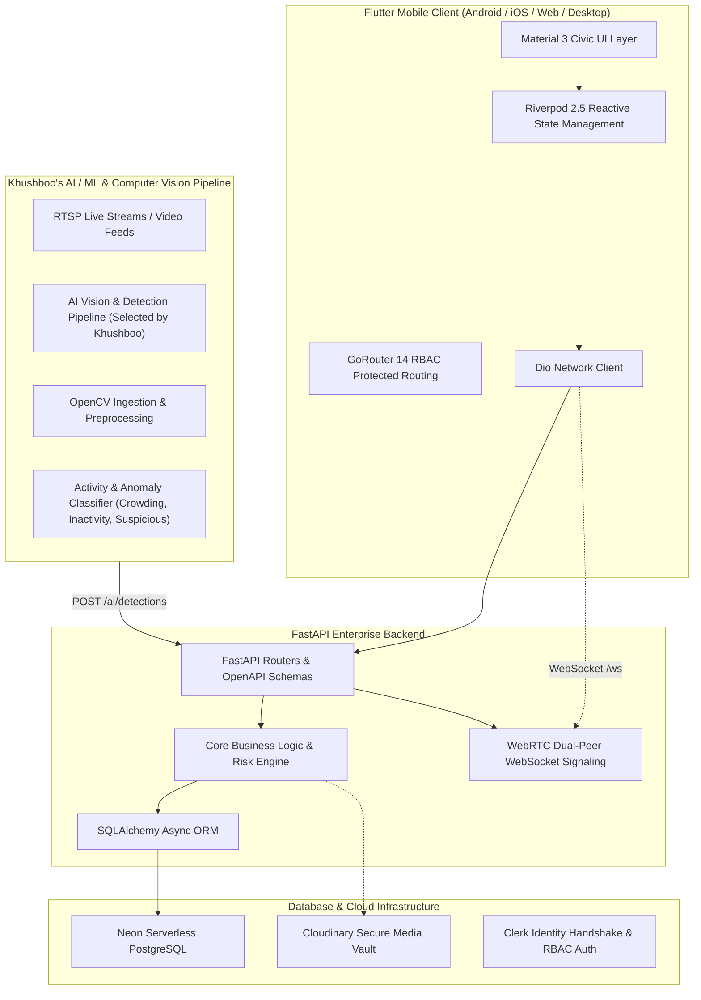

# 🇮🇳 DoSJE Sentinel — Real-Time Monitoring & Inspection System

> **Smart India Hackathon (SIH) Project**  
> **Department of Social Justice and Empowerment (DoSJE) — Govt. of India**  
> *AI-Powered CCTV Analytics, Dynamic Risk Scoring, Geo-Tagged Auditing & Real-Time Inspection Governance*

---

## 📌 Executive Summary

**DoSJE Sentinel** is an end-to-end governance and monitoring platform built to ensure operational compliance, fraud prevention, and transparent service delivery across subsidized welfare institutions across India (e.g. Senior Citizen Care Homes, De-addiction Rehabilitation Centers, Residential Special Schools, Skill Training Centers).

The platform integrates continuous CCTV computer vision analysis, automated worker attendance tracking, multi-signal risk calculation, geofenced mobile field inspections, WebRTC live video audits, and regulatory audit logging into an authoritative civic architecture.

---

## 🏗️ System Architecture



---

## 🤖 AI/ML & Computer Vision Pipeline

The AI/ML module is responsible for converting video input into useful, explainable events and risk information for the DoSJE Sentinel platform.

### Pipeline

**Video Input → YOLO Detection → ByteTrack Tracking → Activity Analysis → Event Extraction → Risk Assessment → Backend Integration**

### 1. Video Processing
- Uses OpenCV for video input and frame processing.
- Processes video frames continuously for AI inference.
- Supports frame-level analysis required for real-time monitoring.

### 2. Person Detection & Tracking
- Uses **YOLO** models for person detection.
- Uses **ByteTrack** for maintaining person identities across frames.
- Tracks the number and movement of people detected in the scene.
- Detection confidence is retained for further risk analysis.

### 3. Pose & Activity Analysis
- Uses the YOLO pose model to analyse human keypoints.
- Movement between frames is used to identify activity levels.
- The system can identify states such as:
  - Normal activity
  - Low activity
  - High activity
  - No activity

### 4. Real-Time Event Extraction
The AI pipeline converts raw detections into structured events instead of sending only model predictions.

Events include:
- `STATE_UPDATE`
- `NORMAL_ACTIVITY`
- `LOW_ACTIVITY`
- `HIGH_ACTIVITY`
- `NO_ACTIVITY`
- `ALERT_STARTED`
- `ALERT_CONTINUING`
- `ALERT_CLEARED`

The event manager maintains the event history and current alert state.

### 5. Explainable Risk Assessment
The risk engine produces a **0–100 risk score** along with the reasons behind the score.

Risk factors include:
- Prolonged inactivity
- No people detected
- Low or high activity
- High number of people
- Multiple people detected
- Low detection confidence

Risk levels are classified as:
- `LOW`
- `MEDIUM`
- `HIGH`
- `CRITICAL`

This keeps the AI output explainable instead of treating the model as a black box.

### 6. Alert Generation
The risk and event engines work together to determine whether an observation should become an alert.

The generated AI result can contain:
- Number of people detected
- Risk score
- Risk level
- Risk reasons
- Event type
- Alert severity
- Alert reason
- Timestamp

### 7. Backend Integration
AI results are prepared as structured JSON and sent to the backend through the AI detection integration.

This creates a clean separation between:
- **AI/ML:** detection, tracking, activity analysis, events and risk
- **Backend:** data processing, storage and application services
- **Flutter:** visualization and user interaction

### AI/ML Components

```text
ai_ml/
├── core/
│   ├── ai_client.py
│   ├── ai_engine.py
│   ├── ai_engine_integrated.py
│   ├── ai_event_manager.py
│   ├── risk_alert_engine.py
│   └── risk_engine.py
│
├── models/
│   ├── yolo11n.pt
│   └── yolo11n-pose.pt
│
├── tests/
│   ├── ai_test.py
│   ├── ai_tracking_test.py
│   ├── ai_video_test.py
│   ├── test_event_manager.py
│   ├── test_risk_alert_engine.py
│   └── test_risk_engine.py
│
└── videos/
    └── sample monitoring video

## 🧩 The 16 Operational Modules

| # | Module Name | Description | Status |
| :---: | :--- | :--- | :---: |
| **1** | **Project CRUD** | Facility onboarding, scheme code generation, coordinates, progress tracking. | ✅ Verified |
| **2** | **Project Summary** | Consolidated operational snapshot, metrics, and KPI aggregation. | ✅ Verified |
| **3** | **CCTV / Camera Management** | Camera registration, RTSP stream URLs, health automation (`last_active` tracking). | ✅ Verified |
| **4** | **AI Detection Boundary** | Ingestion of people count, activity classifications, and historical summaries. | ✅ Verified |
| **5** | **Attendance Engine** | Expected vs detected workers, real-time attendance percentage derivation. | ✅ Verified |
| **6** | **Risk Score Engine** | Multi-signal weighted risk calculation (`LOW`, `MEDIUM`, `HIGH`, `CRITICAL`). | ✅ Verified |
| **7** | **Alert Generation** | Anomaly-driven alerts with automated deduplication for open items. | ✅ Verified |
| **8** | **Inspections** | Routine, surprise, and alert-triggered inspection scheduling lifecycle. | ✅ Verified |
| **9** | **Video Sessions** | Dual-peer WebRTC signaling and lifecycle tracking via WebSockets. | ✅ Verified |
| **10** | **Reports & Evidence** | Cloudinary photo/video upload & authoritative multi-domain aggregation dossier. | ✅ Verified |
| **11** | **Notifications** | Role-filtered alert and inspection dispatch notices. | ✅ Verified |
| **12** | **Audit Logs** | Immutable regulatory audit log trail tracking all domain entity mutations. | ✅ Verified |
| **13** | **Camera Health** | Automated camera uptime evaluation, stale stream detection, and alert rules. | ✅ Verified |
| **14** | **Inspector Roster** | Inspector directory, manual dispatch, and randomized assignment engine. | ✅ Verified |
| **15** | **Geo-Tagged Verification** | Device GNSS capture and authoritative 50m perimeter Haversine verification. | ✅ Verified |
| **16** | **E2E Workflow Hardening** | Cross-module operational validation, provider invalidation, error boundaries. | ✅ Verified |

---

## 📱 User Personas & Screen Navigation

```
                       ┌───────────────────────────┐
                       │   Clerk Unified Sign-In   │
                       └─────────────┬─────────────┘
                                     │
        ┌────────────────────────────┼────────────────────────────┐
        ▼                            ▼                            ▼
┌──────────────────┐       ┌──────────────────┐       ┌──────────────────┐
│NGO Representative│       │  Field Inspector │       │Directorate Officer│
│     (/ngo/*)     │       │  (/inspector/*)  │       │  (/official/*)   │
└──────────────────┘       └──────────────────┘       └──────────────────┘
```

1. **NGO Representative (`/ngo/*`)**:
   - `NgoHomeScreen`: Personalized greeting, facility cards, urgent surprise video call banner.
   - `NgoProjectsScreen`: Facility listing, capacity metrics, camera feeds.
   - `NgoInspectionsScreen`: Completed audit dossiers and compliance status.
   - `NgoOnboarding`: 4-step DARPAN institutional registration workflow.
2. **Department Inspector (`/inspector/*`)**:
   - `InspectorDashboardScreen`: Calendar queue and assigned inspections.
   - `InspectionExecutionScreen`: **Core field tool** — GNSS geofence check (50m), photo/video evidence capture, WebRTC video inspection launcher.
   - `InspectionReportDraftScreen`: Audit findings, compliance verdict, corrective action deadlines.
3. **Directorate Official (`/official/*`)**:
   - `OfficialDashboardScreen`: National monitoring KPIs, active CCTV count, high-risk institution flags.
   - `AiRiskAnalyticsScreen`: Multi-signal risk breakdown and attendance trends.
   - `InspectorRosterScreen`: Inspector directory with 1-click random or manual dispatch.
   - `OfficialAlertsScreen`: Anomaly alert inbox with 1-click surprise inspection creation.
   - `AuditLogsScreen`: Regulatory audit log explorer.

---

## 🚀 Quick Start Guide

### Prerequisites
- Python 3.12+ (Backend)
- Flutter 3.24+ (Mobile Client)
- Neon PostgreSQL connection string (configured in `.env`)
- Cloudinary credentials (configured in `.env`)

---

### 1. Running the FastAPI Backend

```bash
cd backend

# Create & activate virtual environment
python3 -m venv .venv
source .venv/bin/activate

# Install dependencies
pip install -r requirements.txt

# Run backend server
uvicorn app.main:app --host 0.0.0.0 --port 8000 --reload
```

- **Interactive API Docs (Swagger):** `http://localhost:8000/docs`
- **ReDoc Documentation:** `http://localhost:8000/redoc`

---

### 2. Running the Flutter App

```bash
cd dosje_sentinel

# Fetch dependencies
flutter pub get

# Run on connected device (Android, iOS, Web, macOS)
flutter run
```

---

### 3. Building Android APK for Phone Testing

```bash
cd dosje_sentinel

# Build release APK pointing to your host backend
flutter build apk --release --dart-define=API_BASE_URL=http://YOUR_MAC_IP:8000

# Install directly to phone via USB (ADB)
adb install -r build/app/outputs/flutter-apk/app-release.apk
```

---

## 🧪 Testing & Verification Baseline

| Test Suite | Tests Passed | Pass Rate |
| :--- | :---: | :---: |
| **Flutter Integration & Unit Tests** | **207 / 207** | **100% ✅** |
| **Backend Pytest Regression Tests** | **427 / 427** | **100% ✅** |
| **Flutter Analyzer (`--no-fatal-infos`)** | **0 errors, 0 warnings** | **Clean ✅** |
| **Neon PostgreSQL Parity** | **0 schema drift** | **Synced ✅** |

---

## 📂 Repository Layout

```text
Dosje-SIH-Project/
│
├── backend/                              # FastAPI Python Backend
│   ├── app/
│   │   ├── api/                          # REST Routers (ai, alerts, inspections, risk, etc.)
│   │   ├── core/                         # Configuration, Database engine, Geofence utils
│   │   ├── models/                       # SQLAlchemy Database Entities (15 Models)
│   │   ├── schemas/                      # Pydantic Request & Response Data Contracts
│   │   └── services/                     # Business logic (Risk engine, Deduplication)
│   ├── tests/                            # 427 Pytest test cases
│   └── requirements.txt                  # Python dependencies
│
├── dosje_sentinel/                       # Flutter Mobile Client
│   ├── lib/
│   │   ├── app/                          # Theme (Civic Colors, Typography, Spacing)
│   │   ├── core/                         # ApiClient, ApiEndpoints, Auth Guards
│   │   ├── features/
│   │   │   ├── auth/                     # Unified Login & Clerk SSO
│   │   │   ├── inspector/                # Field Audit Execution, Reports, Video Call
│   │   │   ├── ngo/                      # NGO Home, Onboarding, Facilities
│   │   │   └── official/                 # Dashboard, Analytics, Roster, Alerts
│   │   ├── repositories/                 # Riverpod Data Access Repositories
│   │   └── shared/                       # Shared Models & Material 3 Civic Widgets
│   ├── test/                             # 207 Flutter integration tests
│   └── pubspec.yaml                      # Flutter dependencies
│
└── README.md                             # Complete Project Blueprint
```

---

## 👥 Contributors & Core Team

- **DoSJE Sentinel SIH Team**
- **Computer Vision & AI/ML Pipeline:** Khushboo
- **Backend Architecture & Integration:** Yagyesh Singh
- **Frontend & Mobile Development:** Yagyesh Singh

---
*Developed for the Smart India Hackathon (SIH) — Department of Social Justice and Empowerment, Government of India.*
